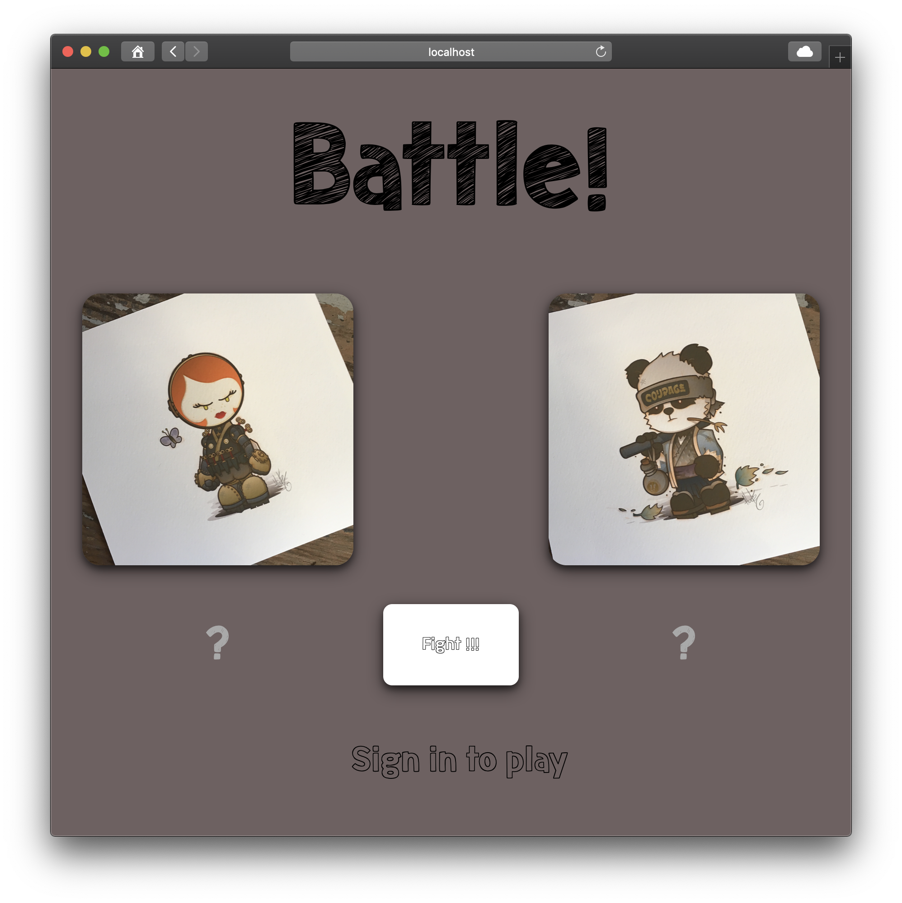
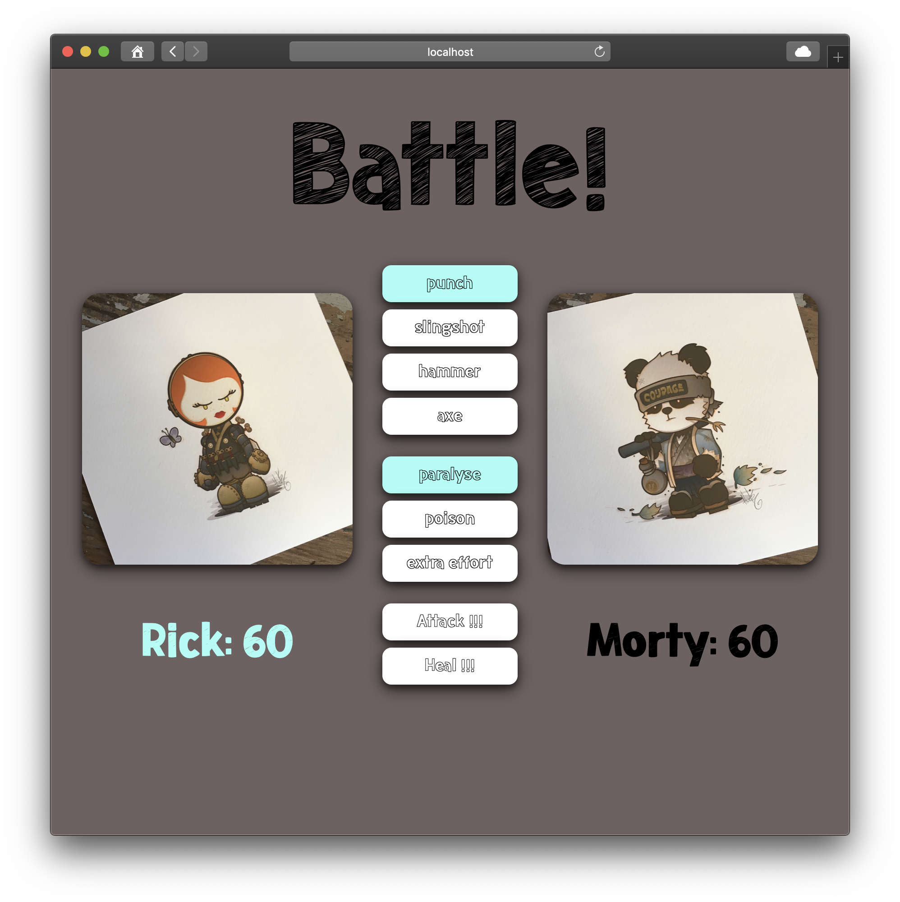
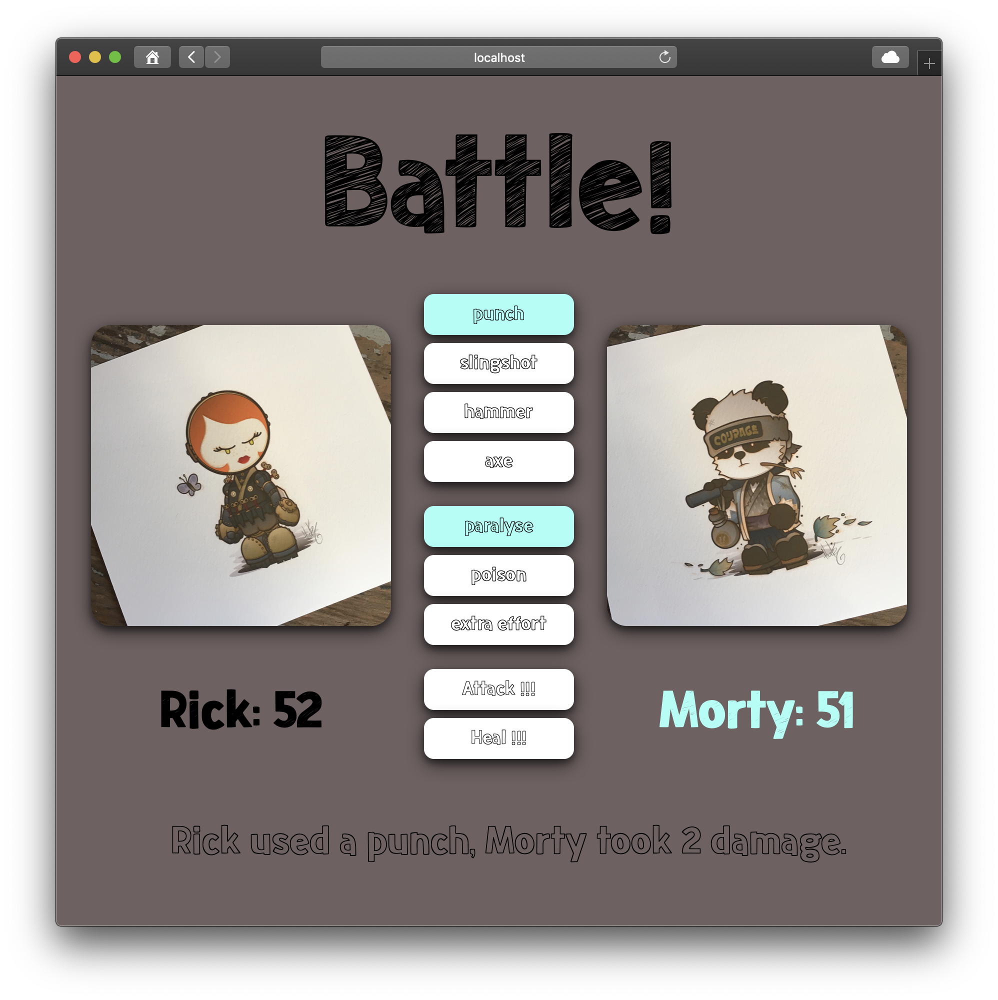
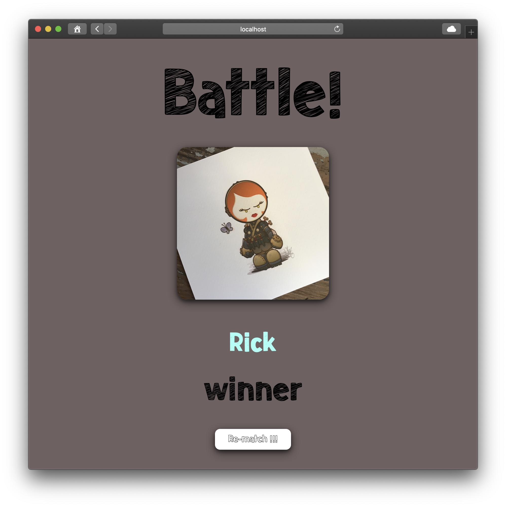

# Battle

Makers Week 3 (afternoons) - This project is a game for two players to have a battle.

## Getting started

Assuming you have `git` installed, in the location of your choice, in Terminal:

`git clone git@github.com:alittlecross/battle.git`

`cd` into the `battle` folder.

Assuming you have Ruby and Bundler installed, in that same location, in Terminal:

`bundle`

## Usage

In that same location, in Terminal:

`rackup`

Then in the browser of your choice:

`http://localhost:9292/`

You should see the enter names screen:

You should enter names where the `?` are and click `Fight !!!`.

The players whose turn it is is highlighted; you can choose a weapon, and an add-on and, click `Attack !!!` or you can choose to heal yourself by clicking `Heal !!!`.

You should see a report after each turn.

The winner will be declared when one player has 0 health points left.

## Running tests

In that same location, in Terminal:

`rspec`

## Linting

In that same location, in Terminal:

`rubocop`
