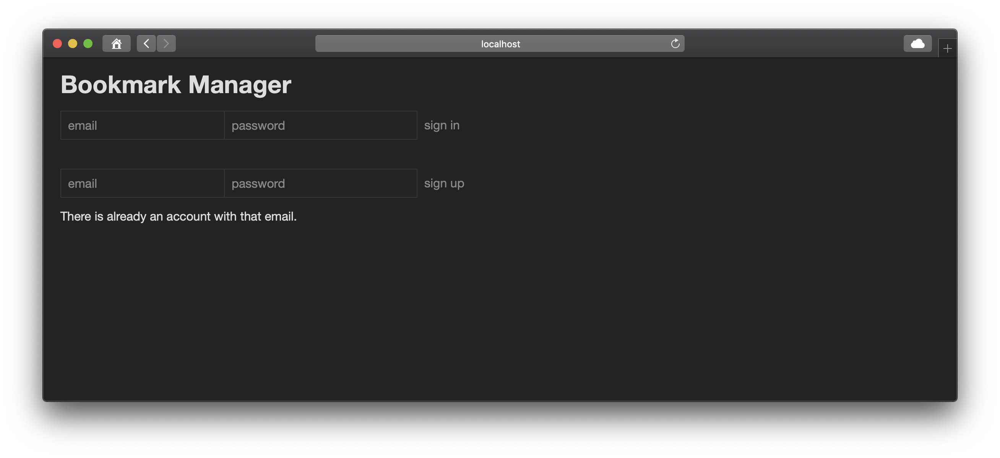

# Bookmark Manager

Makers Week 4 (afternoons) - This project is a web app for saving bookmarks.

## Getting started

Assuming you have `git` installed, in the location of your choice, in Terminal:

`git clone git@github.com:alittlecross/bookmark-manager.git`

`cd` into the `bookmark-manager` folder.

Assuming you have `Ruby` and `Bundler` installed, in that same location, in Terminal:

`bundle`

## Database Setup

In Terminal:

```
brew install postgresql

ln -sfv /usr/local/opt/postgresql/*.plist ~/Library/LaunchAgents
launchctl load ~/Library/LaunchAgents/homebrew.mxcl.postgresql.plist

psql postgres
```

Then paste the SQL script `00_create_databases` from the `db/migrations` folder.

Change database using `\c bookmark_manager`

Then paste the remaining SQL scripts from the `db/migrations` folder in the given order.

Change to `bookmark_manager_test` and repeat the above step if you intend to run rspec.

## Usage

In that same location, in Terminal:

`rackup`

Then in the browser of your choice:

`http://localhost:9292/`

You should see the sign in/sign up page:


Existing users can enter their email and password in the form fields beside `sign in`:


You will be presented with an error if you use these fields without having an account:


If you have an account but the password does not match that stored in the database, you will be presented with error:


New users can enter their email and password in the form fields beside the `sign up` button:


They will be presented with an error if there is already an account with that email address:



Once signed in you should see a table listing all of your bookmarks:


To add a bookmark you should enter a title and url in the `website` and `address` fields respectively:


An error is presented if an invalid url is entered:


Once a bookmark has been added you can add a comment:


You enter a comment in the form field beside the `comment` button:


Once a bookmark has been added you can add a tag:


You enter a tag in the form field beside the `tag` button:


Once a bookmark has been added you can update it:


You change the bookmark in the form fields beside the `update` button:


You can delete a bookmark by clicking the `delete` button:


Tags are clickable filters:


The tag filter will show all bookmarks that have that tag; `clear filter` will return to the list of all bookmarks:


Clicking `Sign Out` at any time will return you to the sign in/sign up page:


## Running tests

In that same location, in Terminal:

`rspec`

## Linting

In that same location, in Terminal:

`rubocop`
