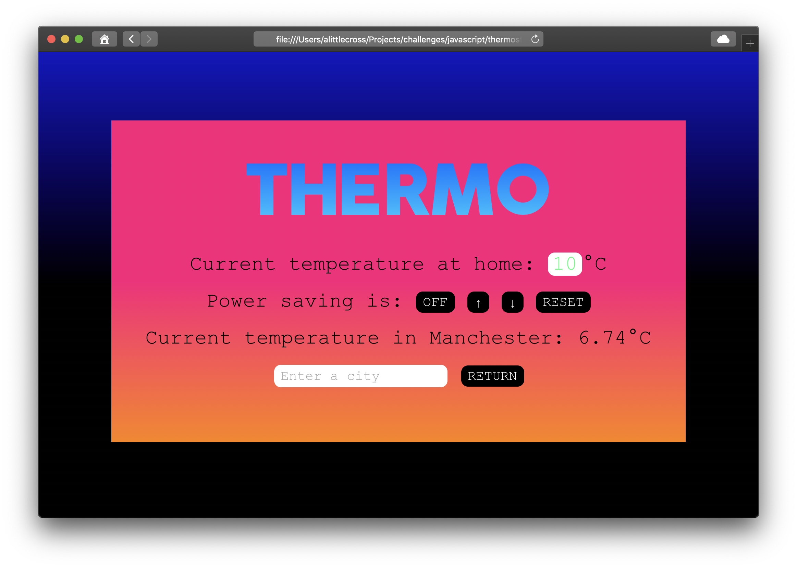
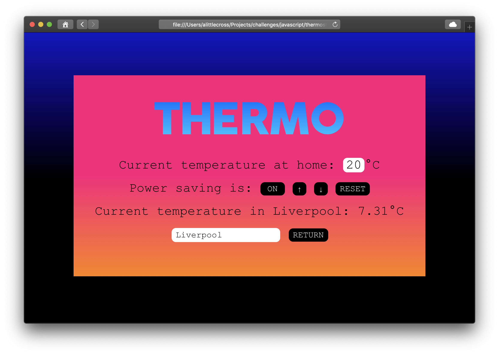

# Thermostat

Makers Week 5 (afternoons) - This project is a web app to control a thermostat at home and display the weather for your area.

## Getting started

In the location of your choice, in Terminal:

`git clone git@github.com:alittlecross/thermostat.git`

In that same location, in Terminal:

`bundle`

Assuming you have Node.js and NPM installed, in that same location, in Terminal:

`npm install`

## Usage

In that same location, in Terminal:

`rackup`

This will start the backend to save and retreive the state when navigating to and from the frontend. The frontend can be used without the backend however, nothing entered will persist between sessions.

In that same location, in Terminal:

`open src/index.html`

The user should see the thermostat with the settings from the last session, or the default settings if this is the first use:

Power saving is on by default so the upper limit will be 25 when increasing the temperature:

When power saving is turned off the upper limit will be 32:

The lower limit is 10 when decreasing the temperature:

The user can enter a city and click return to see the weather for that area:

The user can reset the thermostat at any time:

## Running tests

In that same location, in Terminal:

`open SpecRunner.html`

## Linting

For the backend, in that same location, in Terminal:

`rubocop`

For the frontend, in that same location, in Terminal:

`./node_modules/.bin/eslint src`
