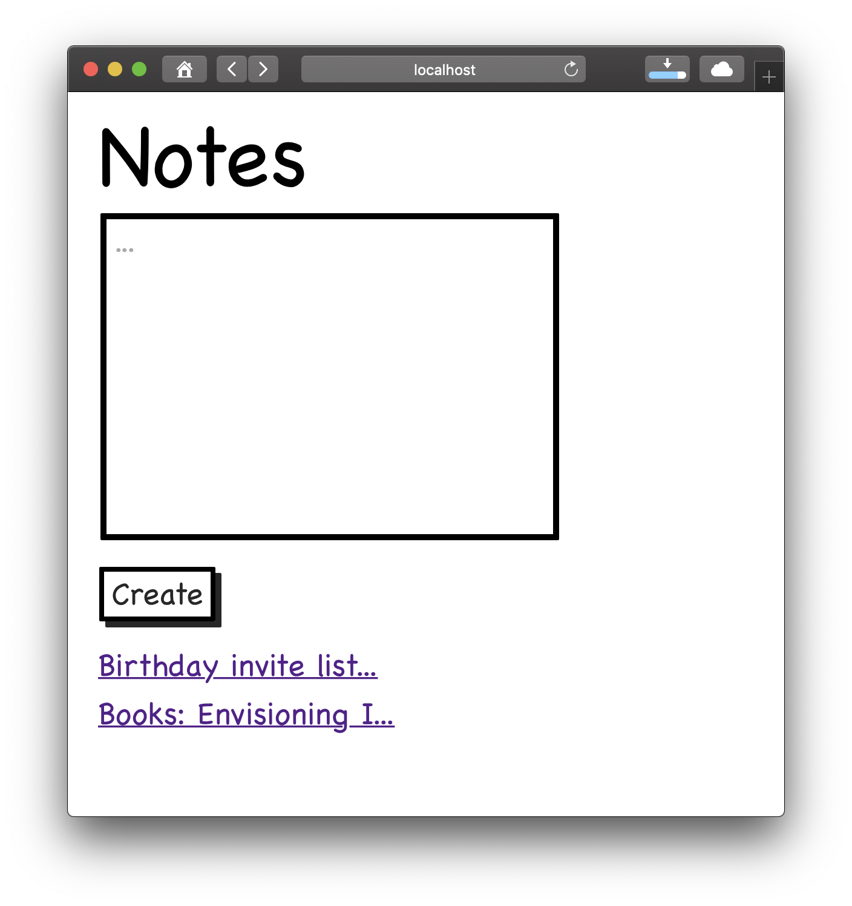
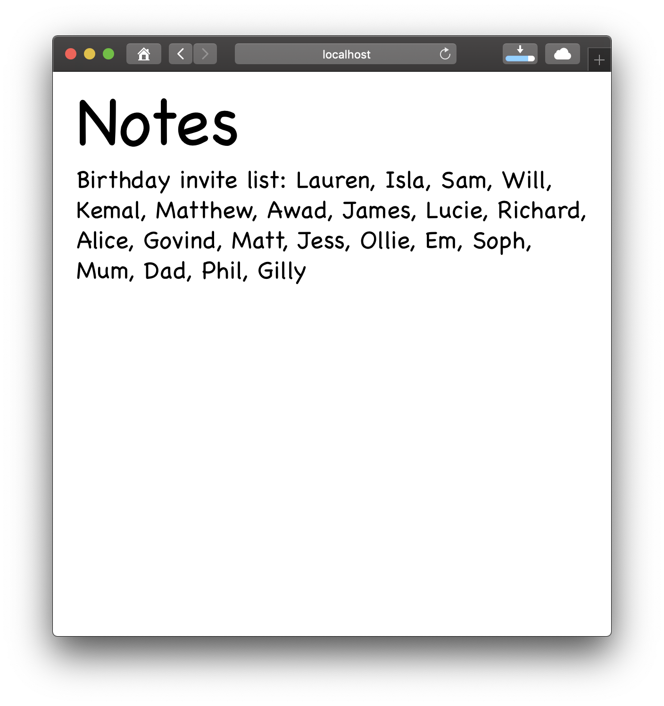
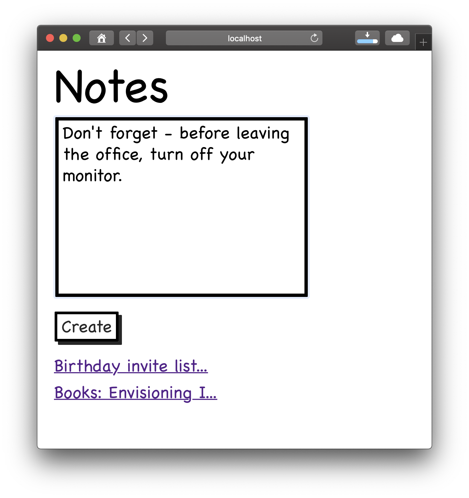
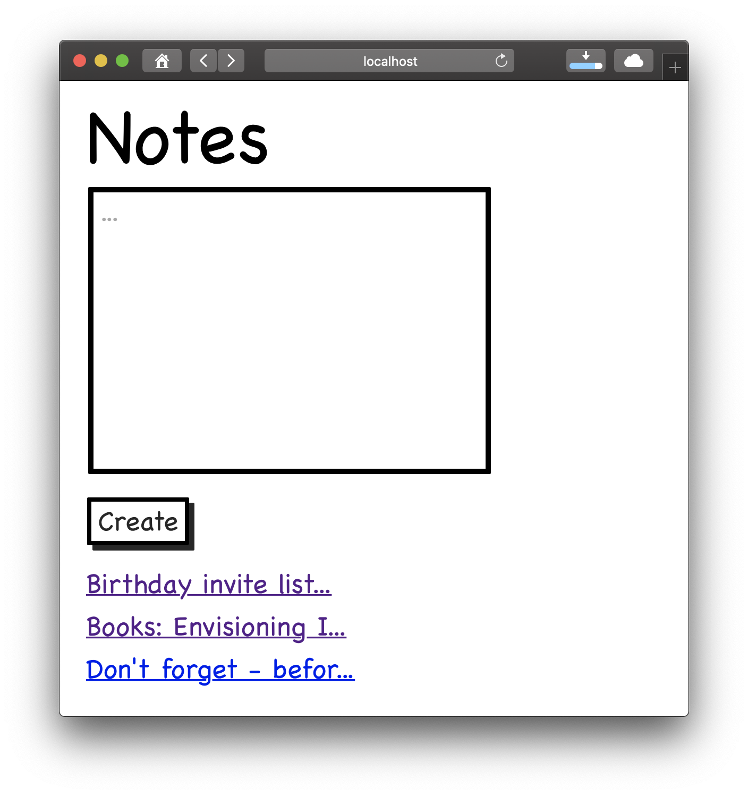
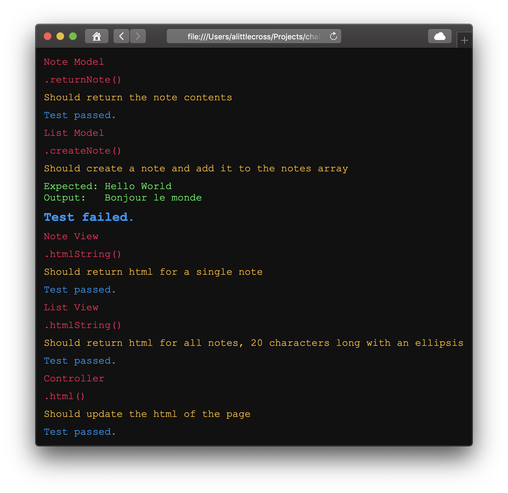

# Notes App

Makers Week 7 (afternoons) - this project is a single page web app built and tested without existing frameworks.

## Getting Started

In the location of your choice, in Terminal:

`git clone git@github.com:alittlecross/notes-app.git`

`cd` into the `notes-app` folder.

Assuming you have Node.js and NPM installed, in that same location, in Terminal:

`npm install`

## Usage

In that same location, in Terminal:

`./node_modules/.bin/http-server`

Then in the browser of your choice:

`http://localhost:8080/`

The user should see the notes app:

(n.b. yes, I did make it look just like the wireframes in the instructions)



Click on a note link to see the full note:



Add text to the note box and click create:



The new note will be added to the list:



## Running tests

In order to test the app I wrote a test framework. I named it Spectrum.

Spec files are written syntactically similar to Jasmine, albeit with far fewer matchers at the moment.

```
describe('.createNote()', function () {
  it('Should create a note and add it to the notes array', function () {
    list.createNote('Bonjour le monde')
    expect(list.list[0].note).toEqual('Hello World')
  })
})
```
  
To run the tests locally, in that same location, in Terminal:

`open Spectrum/Spectrum.html`

The user should see the test results:



Passing tests will show only a passing message, failing tests will show the expected result and the actual result.

## Linting

In that same location, in Terminal:

`./node_modules/.bin/eslint src`
