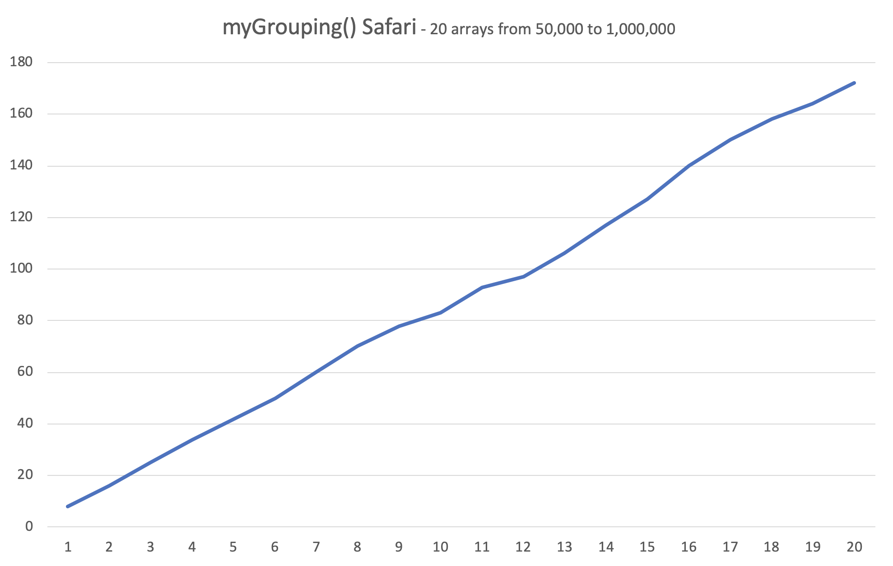

# Algorithmic Complexity

This project was to investigate algorithmic complexity and through a series of workshops learn how to increase the efficiency of our algorithms.

## Definitions

An algorithm is a series of steps to carry out an operation or transform from an `input` to an `output`.

Complexity is the number of steps required to work through that algorithm.

##  Timing Framework

Using JavaScript, I was unable to produce any graphable results for `Array.prototype.reverse()` or `Array.prototype.sort()`, they consistently ran in a time that only output `0`. The same happened for a `.last` algorithm that I wrote myself.

These are the graphs produced with algorithms I wrote; these are all my first attempt, however I did not attempt them in the order given in this week's outline. I will come back to this repo to refactor some of my algorithms at a later date:

I was expecting the above to be smoother, linear, and also a lot quicker, especially for so few steps in the algorithm.

Again, I was expecting smoother, but quadratic. Having ran the tests a number of times the high and low results that throw off the curve were consistantly present but I cannot find a reason for them.

A scarily perfect curve but it was a quadratic curve, as I was expecting.

Given that merge sorting is generally quite efficient, I am surprised this is not quicker. I was also expecting it to be a logarithmic curve but, apart from one or two results, it looks to be quite linear.

These results were quite confusing; after changing the array size increments to narrow down the issue I found the results consistently went unusually high after arrays of 50,000.

After some further research I found that the issue was with Chrome. Re-running the tests in Safari provided a more reliable output. I cannot however find a detailed explanation of why Chrome has this behaviour.

Although satisfyingly straight, I'm not happy with these results; the algorithm iterates through the every element in the array by default, rather than only in the worst case scenario. (this is returning true or false if there are duplicates)

I would also like to revisit this algorithm; this needs to iterate through the entire array to find all duplicate words but I need not start back at the beginning of the array after each duplicate is found (this is returning a list of all the duplicates)

I was expecting a quadratic curve, however given that the algorithm doesn't rely on the values of the element in the array, I was expecting a smoother curve.

The approach I took for this one could definitely be applied to FindDuplicatesB; FindDuplicatesA is already quite similar in approach but could be quicker for other reasons.

I could apply the same approach to this algorithm as I did to merge sort however I think this algorithm would be greatly improved by factoring out `.unshift`.

Although very linear, I had difficulties with the timing framework. When increasing the size of the arrays I also had to increase the size of the total being aimed for which produced wildly different results. In the end I chose to generate arrays only of 3's and the total being aimed for being 10; this meant the total was never reached and the worst case scenario was tested for. I could have used arrays of 3's and a total being aimed for of 10,000 (or any large number indivisible by 3) but this would have incresed the length of time to run but still produce a linear graph, which has already been confirmed.
